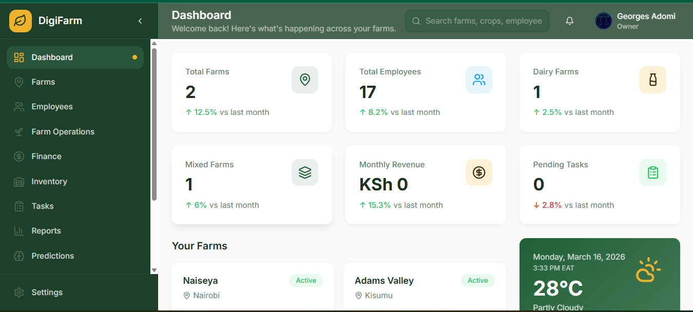

<p align="center">
  
</p>

<h1 align="center">🌾 Farm Harmony Hub</h1>

<p align="center">
  <strong>AI-Powered Multi-Farm Management and Agricultural Intelligence Platform</strong><br/>
  <em>Helping farmers manage crops, livestock, poultry, finances, and operations using intelligent insights.</em>
</p>

<p align="center">
  
  
  
  
  
  
  
</p>

---

# 📖 Overview

Farm Harmony Hub is a **modern AI-powered farm management platform** designed to help farmers and agricultural organizations manage **multiple farms, crops, livestock, poultry, finances, and resources** from a single intelligent dashboard.

The system integrates **agricultural operations, predictive analytics, weather intelligence, anomaly detection, and farm resource management** to help farmers make **data-driven decisions** that improve productivity and sustainability.

The platform enables farmers to:

* Manage **multiple farms simultaneously**
* Monitor **crop and livestock production**
* Track **financial performance**
* Manage **inventory and farm resources**
* Assign and track **farm tasks**
* Receive **weather forecasts based on farm location**
* Detect **operational anomalies**
* Get **AI-powered irrigation suggestions**
* Predict **mixed farm production outputs**

---

# 🚜 Core Features

## 🌱 Multi-Farm Management

Manage and monitor **multiple farms from a single dashboard**.

* Farm registration and management
* Farm location tracking
* Farm-specific analytics
* Centralized farm monitoring

---

## 🌾 Crop Management

Track and optimize crop production.

* Crop planning and scheduling
* Crop growth monitoring
* Harvest tracking
* Yield analysis and prediction

---

## 🐄 Livestock Management

Monitor livestock productivity and health.

* Animal records management
* Production tracking
* Feeding schedules
* Health monitoring

---

## 🐔 Poultry Management

Tools specifically designed for poultry operations.

* Flock management
* Egg production tracking
* Feeding and health monitoring
* Mortality tracking

---

## 🌾 Mixed Farm Production Prediction

AI-driven analytics to forecast total farm productivity.

Includes predictions for:

* Crop yield
* Livestock output
* Poultry production
* Overall farm productivity

---

## 📦 Inventory Management

Track all farm inputs and resources.

* Farm supplies monitoring
* Equipment inventory tracking
* Feed and fertilizer management
* Low stock alerts

---

## 💰 Financial Management

Track the financial health of each farm.

* Expense tracking
* Revenue monitoring
* Profit and loss analysis
* Financial dashboards

---

## 📋 Task Management

Organize farm activities and workers.

* Task assignment
* Activity scheduling
* Worker coordination
* Task progress tracking

---

## 🌦 Weather Forecasting

Weather intelligence based on **farm location**.

* Location-based weather predictions
* Rainfall forecasts
* Temperature monitoring
* Climate risk alerts

---

## 🚨 Anomaly Detection

AI-powered system to detect unusual farm patterns.

Examples include:

* Sudden livestock loss
* Abnormal production patterns
* Inventory inconsistencies
* Environmental anomalies

This helps farmers **identify issues early and respond quickly**.

---

## 💧 Smart Irrigation Suggestions

The system analyzes:

* Weather data
* Crop requirements
* Environmental conditions

to provide **optimized irrigation recommendations** for each farm.

---

# 📸 Screenshots

*(Add your screenshots here once available)*


Example layout:

```
/screenshots

dashboard.png
farm-overview.png
crop-management.png
livestock-dashboard.png
financial-dashboard.png
```

Then embed them like this:

```markdown
## Dashboard


## Farm Overview


## Crop Management

```

---

# 🏗 System Architecture

```
                 ┌───────────────────────┐
                 │        Frontend       │
                 │   React + Vite + TS   │
                 └─────────────┬─────────┘
                               │
                               │ API
                               ▼
                 ┌───────────────────────┐
                 │      Backend API      │
                 │  (Future Integration) │
                 └─────────────┬─────────┘
                               │
                               │
            ┌──────────────────┴───────────────────┐
            ▼                                      ▼
   ┌─────────────────┐                   ┌──────────────────┐
   │ Farm Data Layer │                   │ AI Intelligence  │
   │ Farms           │                   │ Predictions      │
   │ Crops           │                   │ Anomaly Detection│
   │ Livestock       │                   │ Irrigation AI    │
   │ Inventory       │                   │ Weather Analysis │
   └─────────────────┘                   └──────────────────┘
```

---

# 🛠 Technology Stack

The project is built with modern web technologies.

### Frontend

* React
* TypeScript
* Vite
* Tailwind CSS
* shadcn/ui

### Future Enhancements

* AI analytics engine
* Weather API integration
* Farm IoT integration

---

# ⚙️ Installation

## 1️⃣ Clone the Repository

```bash
git clone <YOUR_REPOSITORY_URL>
```

---

## 2️⃣ Navigate to Project Directory

```bash
cd farm-harmony-hub
```

---

## 3️⃣ Install Dependencies

```bash
npm install
```

---

## 4️⃣ Run Development Server

```bash
npm run dev
```

The application will run at:

```
http://localhost:8080
```

---

# 📊 Use Cases

This platform can be used by:

* Individual farmers
* Agricultural cooperatives
* Agritech startups
* Agricultural researchers
* Smart farming initiatives

---

# 🔮 Future Improvements

Planned future features include:

* Mobile application
* IoT sensor integration
* Satellite crop monitoring
* AI disease detection
* Advanced production forecasting
* Farm product marketplace
* Drone monitoring integration

---

# 🤝 Contributing

Contributions are welcome.

1. Fork the repository
2. Create a new branch

```
git checkout -b feature-name
```

3. Commit your changes

```
git commit -m "Added new feature"
```

4. Push to your branch

```
git push origin feature-name
```

5. Open a Pull Request

---

# 📄 License

This project is licensed under the **MIT License**.

---

# 🌍 Vision

To empower farmers with **intelligent digital tools that improve agricultural productivity, sustainability, and profitability through data-driven decision making.**
